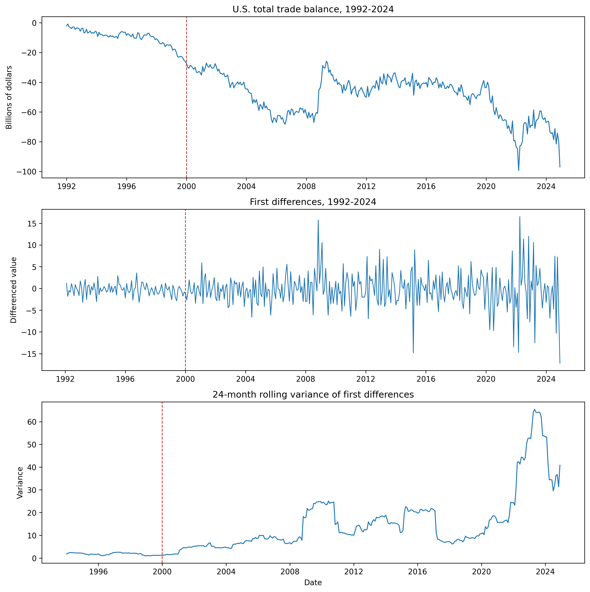
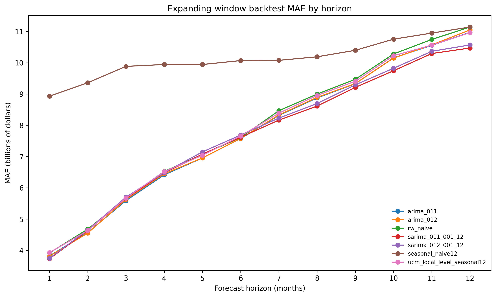
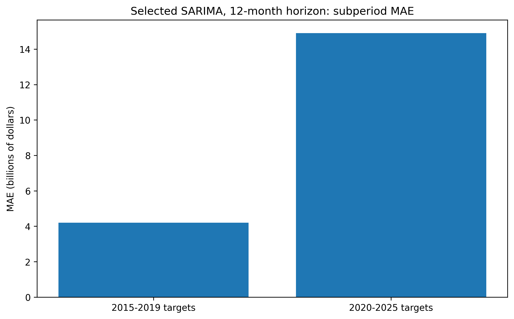
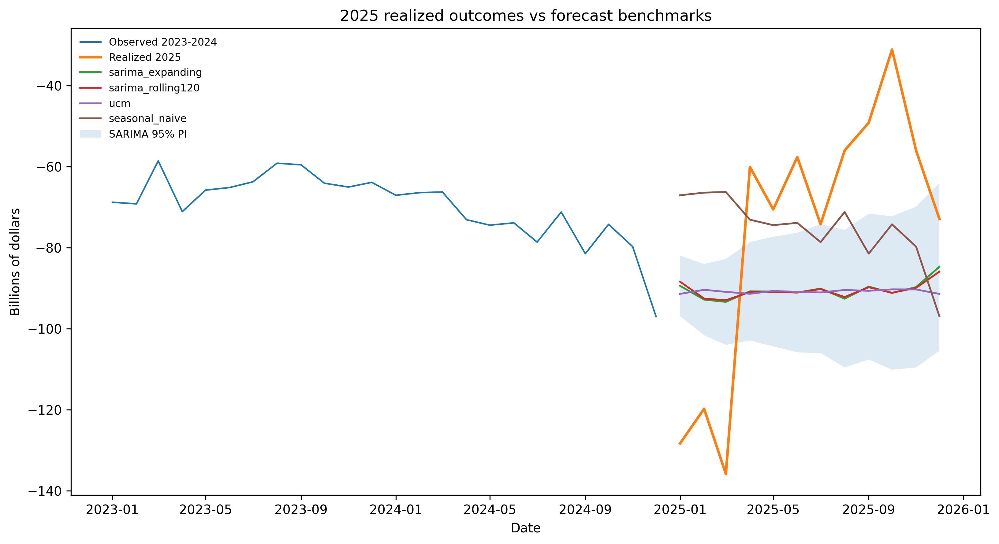

# Regime Instability and Forecast Failure in U.S. Trade-Balance Forecasting

This repository studies a simple but important forecasting problem: **how robust is a diagnostically adequate univariate time-series model when the underlying regime changes?**

The analysis uses monthly U.S. total trade-balance data, starts from a post-2000 SARIMA reference model, and then adds regime diagnostics, rolling-origin backtests, interval evaluation, and ex post comparison with realized 2025 outcomes.

## Research question

A model can pass standard Box–Jenkins diagnostics on a retained historical sample. Does that imply reliable forecasting performance when the environment shifts?

## Data

- `data/raw/USTradeBalances.csv`: monthly U.S. trade-balance series (`Total`, `Goods`, `Services`) from 1992-01 to 2024-12.
- `data/external/trade_balance_actuals_2025.csv`: realized monthly 2025 total trade-balance values added for ex post forecast evaluation.
- Modeling sample for the reference SARIMA specification: 2000-01 to 2024-12.

## Methods

1. Diagnose instability on the full 1992-2024 series.
2. Reproduce the post-2000 SARIMA reference model `SARIMA(0,1,2)x(0,0,1,12)`.
3. Run monthly rolling-origin backtests from 2014-12 to 2024-12.
4. Compare expanding and rolling 120-month windows.
5. Benchmark against naive, seasonal-naive, nearby ARIMA, and state-space alternatives.
6. Evaluate both point forecasts and 95% interval behavior.
7. Compare forecast paths with realized 2025 outcomes.

## Selected findings

### 1) Instability is visible before model fitting

- First-difference variance rises from **1.750** in 1992-1999 to **17.477** in 2000-2024, a **9.99x** increase.
- A Brown–Forsythe / Levene test rejects equal variance across periods (**p = 3.55e-10**).
- A simple ARIMA(0,1,1) residual-variance ratio falls from **8.98** on the full sample to **1.93** on the post-2000 sample.



### 2) The reference SARIMA is historically competitive, but not dominant

At the 12-month horizon:

- expanding-window `SARIMA(0,1,2)x(0,0,1,12)`: **MAE = 10.568**, **coverage = 0.802**
- rolling-120 `SARIMA(0,1,2)x(0,0,1,12)`: **MAE = 10.928**, **coverage = 0.760**

The selected SARIMA is therefore a reasonable historical benchmark, not an obviously weak baseline.



### 3) Performance deteriorates sharply after 2020

For the reference SARIMA at the 12-month horizon:

- **2015-2019 targets:** MAE = **4.200**, coverage = **1.000**
- **2020-2025 targets:** MAE = **14.902**, coverage = **0.667**

This period-specific deterioration is one of the main findings of the project.



### 4) Realized 2025 outcomes expose forecast breakdown

2025 ex post performance in this run:

- seasonal naive: **MAE = 30.019**
- reference SARIMA (expanding window): **MAE = 32.609**, **coverage = 0.167**
- reference SARIMA (rolling 120 months): **MAE = 32.870**, **coverage = 0.167**
- local-level state-space model: **MAE = 33.395**, **coverage = 0.083**

The 2025 comparison is therefore best read as evidence of forecast breakdown under changed conditions, not as a claim of predictive success.



## Repository structure

```text
rade-balance-regime-instability/
├── README.md
├── requirements.txt
├── .gitignore
├── data/
│   ├── raw/
│   │   └── USTradeBalances.csv
│   └── external/
│       ├── README.md
│       └── trade_balance_actuals_2025.csv
├── results/
│   ├── figures/
│   └── tables/
└── scripts/
    └── run_analysis.py
```

## Reproducibility

```bash
python -m venv .venv
source .venv/bin/activate
pip install -r requirements.txt
python scripts/run_analysis.py
```

The script regenerates the tables and figures under `results/`.

## Scope and limits

This is a univariate forecasting case study. It is useful for studying regime instability, forecast robustness, and model criticism. It is not intended as a structural or causal model of U.S. trade dynamics.
